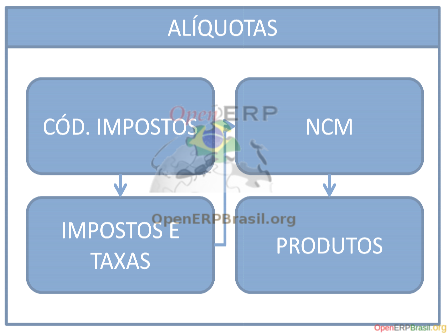
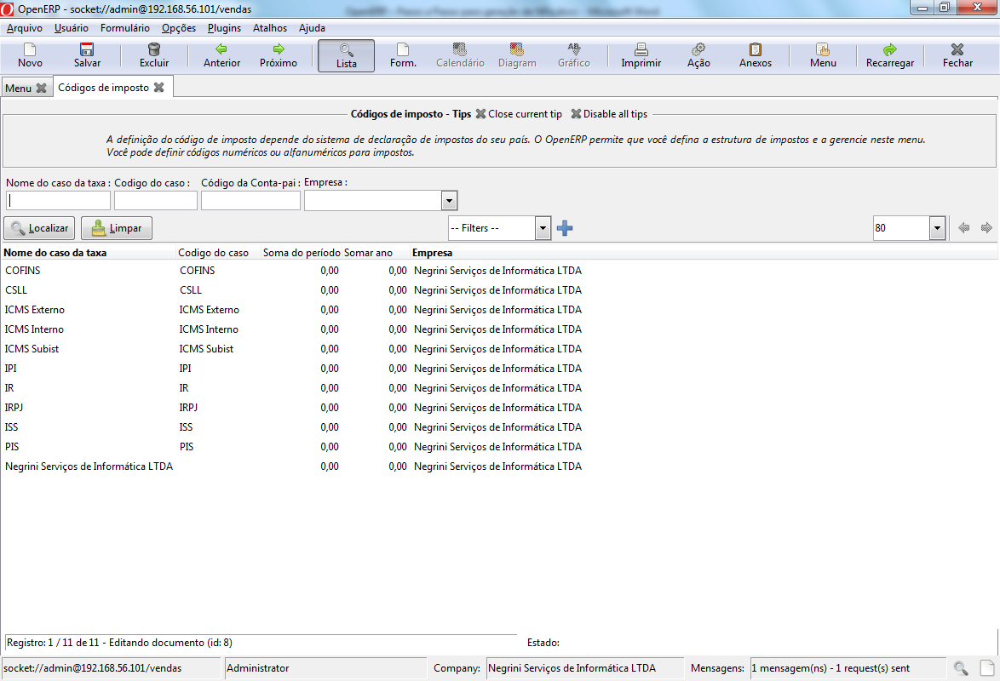

======
Alíquotas
======

A segunda fase da geração de impostos é a geração de alíquotas para as operações que deseja trabalhar.

Códigos de Imposto
------------------------------

Os códigos de imposto já são carregados no juntamente com o plano de contas. Estes dados já são disponibilizados nativamente no OpenERP e a localização Brasil se aproveita destes impostos para fazer a integração Fiscal X Contábil dos dados no OpenERP. Para conferir os dados, no menu Contabilidade acesse: Configuração - Contabilidade Financeira - Taxas - Códigos de Imposto:

Alíquotas
--------------

Ao carregar a localização Brasil já vem pré-carregado um bom número de alíquotas para os impostos disponíveis. Caso não exista uma taxa que você deseje utilizar é possível criar novas a partir do zero ou fazendo cópia de uma taxa pré-existente. Para Conferir os dados, no menu Contabilidade acesse: Configuração - Contabilidade Financeira - Taxas - Taxas

Uma informação essencial para a correta geração da NFe é a informação do domínio para os impostos que serão destacados na nota fiscal, a saber:

IPI
PIS
COFINS
ICMS
É a partir desta informação que os impostos são agrupados. Isto aumenta a flexibilidade fazendo com que, por exemplo, os impostos de ICMS interno, externo e de Substituição sejam contabilizados separadamente, porém lançados todos para o imposto ICMS na NFe garantindo, assim, uma maior flexibilidade na composição dos impostos.

Classificações Fiscais (NCM)
---------------------------------------------

As Classificações Fiscais são informações de uso genérico no OpenERP e são utilizados em vários países. No Brasil, esta classificação é chamada de Nomenclatura Comum do Mercosul (NCM). São nestas operações que fazemos as primeiras definições de alíquotas, principalmente ao que se refere o IPI. Demais alíquotas irão depender de outros fatores como Origem, Destino, Tipo de Parceiro, etc, porém precisamos deixar preparados os impostos utilizando-se de impostos coringa para a determinação dinâmica.

Para visualizar estas informações, no menu Contabilidade acesse: Configuração - Contabilidade Financeira - Classificações Fiscais dos Produtos.

Como exemplo, utilizaremos produtos disponíveis nos dados de demonstração e faremos uma configuração de alíquotas para estes produtos. A lista abaixo exibe os NCMS dos produtos que utilizaremos para exemplo:

Mouse (MOU): 8471.60.53
Teclado (KEYA): 8471.60.52
PC Completo com periféricos (PC0): 8471.30.12

8471.60.52: Perceba que somente os impostos de Vendas estão preenchidos, porém você já pode aproveitar e preencher os impostos de compra. Replique os mesmos impostos disponíveis na aba de vendas para a aba de compras. Perceba que o único imposto que já está pré-fixada a taxa é o IPI. Os demais estão utilizando impostos coringas, deixe como está no exemplo que você entenderá como estes impostos serão trocados dinamicamente. Repita o processo para os outros NCM que utilizaremos como exemplo.

 8471.60.53

 8471.30.12

Dica: Se tiver dúvida com relação ao NCM que deverá utilizar nos produtos que irá comercializar o site www.desenvolvimento.gov.br possui uma sessão inteira dedicada a este tema. Faça sempre esta pesquisa junto com seu contador.

Dica 2: Exija sempre esta informação de seus fornecedores, isto irá lhe poupar de várias dores de cabeça com o fisco futuramente.

Produtos
--------------

Feita a correta parametrização de taxas de IPI e de demais impostos coringa, agora basta que liguemos a classificação fiscal aos produtos que utilizaremos para os testes deste manual. Para acessar o cadastro de produtos, no menu Vendas acesse: Produtos - Produtos

Mouse (MOU): 8471.60.53

Teclado (KEYA): 8471.60.52

PC Completo com periféricos (PC0): 8471.30.12