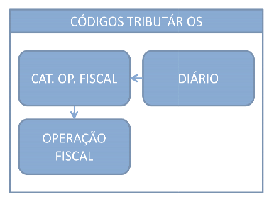
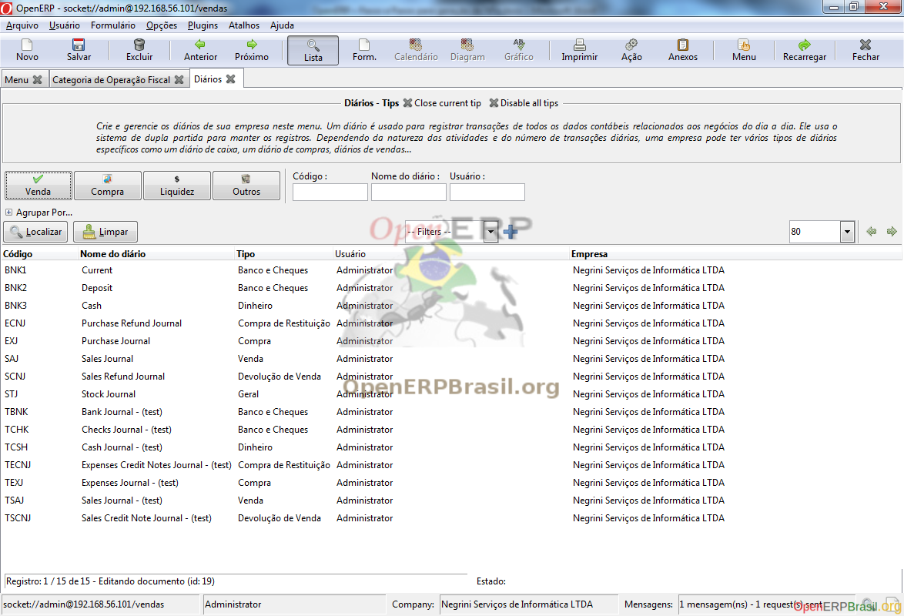
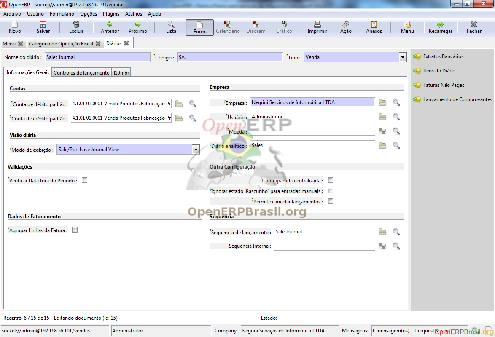

===========
Códigos Tributários
===========

Os códigos de situação tributária, ou CSTs são informações obrigatórias na emissão de uma NFe e o correto preenchimento desta parametrização vai evitar complicações com o fisco. Vamos então iniciar com as etapas para configuração das CSTs seguindo o quadro abaixo:

Diário
-------

A contabilidade do OpenERP é divida em diários. Estes diários definem diversas informações dos lançamentos contábeis gerados e é a primeira etapa das configurações. No menu Contabilidade, acesse: Configuração - Contabilidade Financeira - Diários - Diários

Nesta etapa iremos configurar uma seqüência que será única para todos os diários que podem emitir notas fiscais.

Selecione o Diário de Vendas (SAJ). No campo Seqüência Interna, clique na lupa.

Clique no botão Novo, para criar uma nova seqüência conforme abaixo:

Clique em OK, e salve as informações do diário.

Na aba l10n BR marque a opção Gera Financeiro.

Repita esta etapa também para os diários SCNJ, EXJ, ECNJ.

Categoria de Operação Fiscal
----------------------------------

Nesta etapa cadastraremos categorias de operações que deverão receber configuração específica. Estas categorias devem ser bem claras, pois é esta informação que o operador do processo de compra ou venda deverá informar na criação do seu pedido de compra ou ordem de venda respectivamente.

Podemos citar como categorias: Venda, Venda de Serviço, Bonificação, Compra, Compra de Serviço, Consignação, etc. Neste manual criaremos apenas três:

Venda

Bonificação

Compra

Crie as três categorias conforme as imagens abaixo. Atenção para os diários e para os flags Usado em Vendas, Usado nas Compras, Usado nas Notas Fiscais e Usado nas Listas de Separação.

Detalhes da configuração da categoria de Venda

Detalhes da configuração da categoria de Compra

Detalhes da configuração da categoria de Bonificação

Operação Fiscal
-------------------

Nesta etapa criaremos Operações fiscais que determinarão várias informações dentro de suas operações contábeis, a saber:

CST de cada um dos impostos

CFOP da operação

Modelo do Documento Fiscal

Tipo Fiscal

Deve ser criada uma operação fiscal para cada variação das informações acima você poderá encontrar. Uma dica importante é levantar todos estes detalhes com o contador da empresa que está implantando.

Note que aqui o número de configurações já é maior, mas não se apavore! Você verá que, ao final, a determinação da operação será automática e quem irá operar não precisará saber qual Operação Fiscal deverá utilizar.

A carga de dados de demonstração já traz algumas operações, porém não está completo. Vamos primeiramente completar as informações das operações fiscais que já vieram carregadas.

Para o correto preenchimento, algumas informações importantes:

Para operações Dentro do Estado configure a CST somente para o ICMS Interno;
Para operações Fora do Estado configure a CST somente para o ICMS Externo;
Neste manual não iremos tratar ICMS de Substituição, pretendo criar um documento a parte somente para este assunto, pois é um pouco extenso e merece uma documentação a parte.
Cadastre as CSTs de IPI somente para operações de produto produzido, pois operação de revenda não há incidência de IPI.
O preenchimento do NCM não é necessário. Ele será necessário caso você queira configurar uma CST específica para um NCM sem a necessidade de criar uma nova operação fiscal.

Atualizadas todas as Operações Fiscais pré-cadastradas, vamos criar então, as operações para Bonificação e Compra seguindo a mesma lógica utilizada para as operações fiscais de venda. Outra boa dica é aproveitar a opção de cópia (Menu Formulário - Duplicar) que facilita bastante o trabalho de geração destas informações.

Bonificação Dentro do Estado

Bonificação fora do Estado

Compra de Dentro do Estado para Industrialização

Compra de Fora do Estado para Industrialização