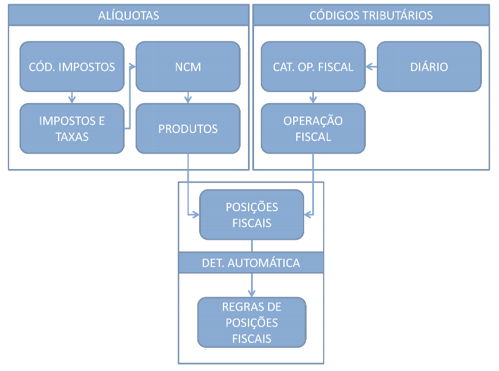

Documentação Fiscal
===================

Configurando Impostos

A configuração de impostos possui quatro fases bem claras:

1. [[Códigos de Situação Tributária (CST) e Operação Fiscal (CFOP)|documentacao-funcional/documentacao-fiscal/codigos-tributarios]]
2. [[Alíquotas|/documentacao-funcional/documentacao-fiscal/aliquotas]]
3. [[Posições Fiscais|/documentacao-funcional/documentacao-fiscal/posicoes-fiscais]]
4. [[Regras para determinações automáticas|/documentacao-funcional/documentacao-fiscal/regras-de-posicoes-fiscais]]
5. Infelizmente, as regras tributárias no Brasil são muito complexas. Espero que esse manual simplifique e esclareça as etapas destas configurações. Abaixo um rápido fluxograma demonstrando as etapas das parametrizações:

