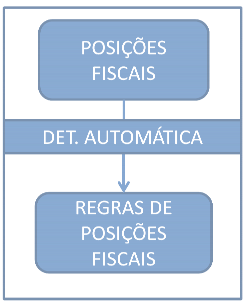
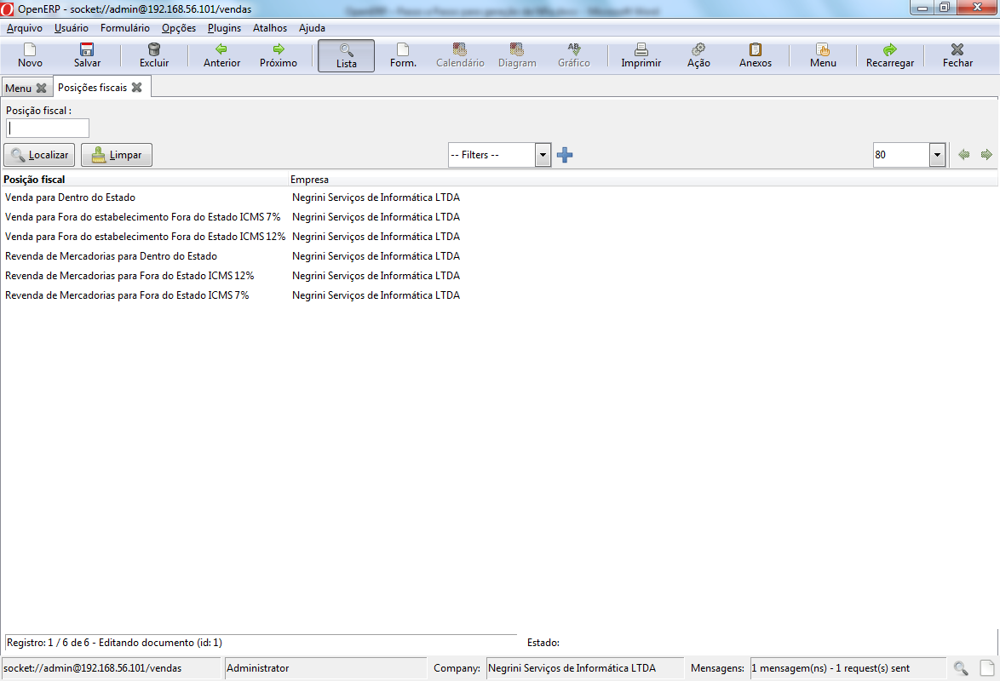

==========
Posições Fiscais
==========

A posição fiscal é o momento de união entre as CST, as CFOP e as taxas previamente configuradas. Nesta etapa criaremos posições fiscais para cada tipo de operação possível considerando as seguintes possibilidades:

Origem do Produto: Nacional ou Exterior
Utilização do produto: Consumo, Insumo ou Imobilizado
Tipo Parceiro: PJ Simples, PJ Contribuinte, PJ Zona Franca ou Pessoa Física
Origem (quando entrada) ou Destino (quando saída) do parceiro: Intra-estadual, Inter-estadual ou Internacional
Categoria: Venda, Compra, Bonificação, etc.
Cada variação destas opções gera algum valor diferente nas informações fiscais que são contidas na NFe e por isso devem ser consideradas.

Para acessar o cadastro de Posições Fiscais, no menu contabilidade acesse: Configuração - Contabilidade Financeira - Taxas - Posições Fiscais:

Perceba que já são carregadas com a localização as operações de Venda e Revenda, porém estão com várias informações incompletas. Vamos, então, completá-las:

É neste momento, então que vamos acertar as alíquotas corretas para a geração e cálculo dos impostos. A regra é bem simples: Quando determinada a posição fiscal, os impostos vindos do NCM do produto serão substituídos de acordo com a regra descrita na tabela Mapeamento de Impostos. Abaixo o detalhamento das substituições:

ICMS Externo - <vazio>: Implica na eliminação deste imposto. Como a operação é uma operação Intra-estadual, o ICMS Externo não faz sentido nesta operação.
ICMS Subst - <vazio>: Implica na eliminação deste imposto. Como a operação não possui substituição de ICMS, o ICMS Subst deve ser desconsiderado
ICMS Interno - ICMS 19%: Implica na aplicação de alíquota de 19% para operação intra-estadual
PIS - PIS 0,65%: Implica na aplicação de alíquota de 0,65% para PIS nesta operação
COFINS - COFINS 3%: Implica na aplicação de alíquota de 3% para COFINS nesta operação
Importante! As substituições só ocorrerão se os impostos coringas estiverem previamente cadastrados no NCM e, conseqüentemente no produto.

Vamos repetir as configurações para as demais Posições Fiscais:

Perceba que nesta opção de venda interestadual, o ICMS que foi anulado foi o ICMS Interno e o substituído foi o ICMS Externo.

Atenção! Na operação de revenda não há incidência de IPI, portanto para a correta configuração elimine a informação de IPI na Classificação Fiscal para os produtos que você irá revender. Caso você possua casos em que o mesmo produto pode ser produzido ou somente comercializado, você pode resolver este problema incluindo mais um mapeamento: IPI 15% - <vazio>; nas operações de revenda.

Vamos agora criar as bonificações. Para facilitar esta etapa, vamos criar a partir de cópias das operações de vendas já cadastradas:

Vamos fazer o mesmo para as operações de compra:

Se você seguiu a risca as dicas deste manual suas posições fiscais devem ter ficado assim:

O próximo passo, então é a criação das regras para determinação automática das posições fiscais em suas operações.