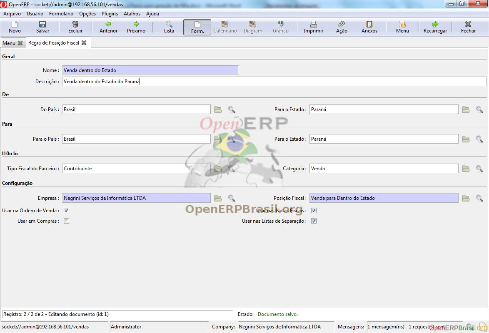
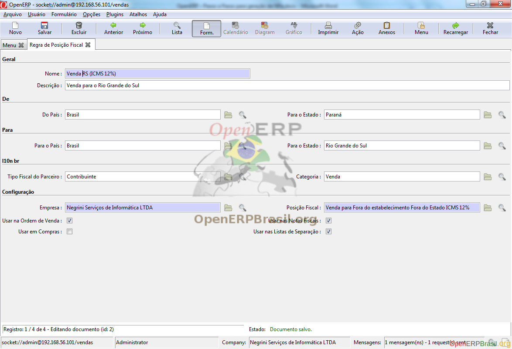

================
Regras de Posições Fiscais
================

A regra de posição fiscal, como o nome sugere, é a regra que o OpenERP irá se basear para determinar automaticamente a Posição Fiscal. Conforme visto, a posição fiscal determina todas as CST, CFOP e taxas da sua operação deixando as informações fiscais completas para a geração de sua NFe. A regra é hierárquica, partindo da mais específica para a mais abrangente o que facilita bastante o trabalho. Graças a esta hierarquia de posições não é necessário cadastrar regra para todos os estados como veremos a seguir.

Operação de Venda Intra-estadutal:

A regra acima diz o seguinte: Quando houver uma Categoria de Venda do estado do Paraná para o Estado do Paraná e o parceiro for contribuinte, use a Posição Fiscal "Venda para Dentro do Estado".

Como as taxas inter-estaduais para RS, SC, PR, SP e RJ é de 12% e os demais estados é de 7%, façamos então o menor esforço e cadastremos uma regra para cada um destes estados e uma regra de exceção conforme abaixo:

Agora regra para os estados com alíquota a 7%

Perceba que o campo Para o Estado está em branco fazendo com que, caso não ache a regra para o caso mais específico (cadastrado para os estados com alíquota a 12%), encontra então esta regra.

Os próximos passos são a criação de Bonificação e Compra. Não iremos tratar revenda neste documento, mas segue a mesma regra.

E finalizando, as operações de compras:

Se você seguiu a risca as configurações deste manual, você deverá possuir uma lista de regras conforme abaixo: