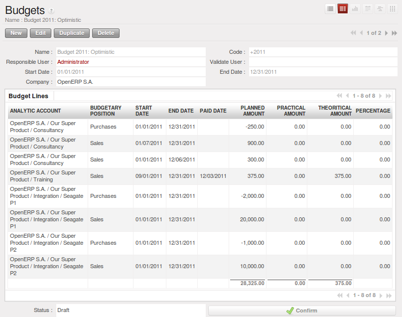

.. index::
  single: financial analysis

.. index:: indicators

Management Indicators
---------------------

.. note:: Financial Indicators

        Indicators, sometimes called financial ratios, are tools for analyzing a company's finances.
        They enable you to compare two accounts or sets of accounts from the balance sheet or the profit
        and loss account, in the form of a ratio.
        They also let you measure the financial health of a company, and make comparisons from one year to
        the next or against those of other companies.

.. index::
   single: module; account_report

To define financial indicators in OpenERP, you should install the module :mod:`account_report` (from ``extra-addons``).
When installing the module, the usual financial indicators are registered in OpenERP.

You can consult your indicators, calculated in real time, from the menu :menuselection:`Accounting -->
Reporting --> Generic Reporting --> Reporting --> Custom reporting`.

Indicators defined by default in OpenERP are the following:

*  :guilabel:`Indicators of Working Capital` : determines if the company can pay its short term debts in
   normal conditions. It is calculated from \ ``(Stocks + Cash + Current Assets) / Current
   Liabilities``\  .

*  :guilabel:`Financial Ratios` : enables you to calculate the company's liquidity. It is defined as follows:
   \ ``( Current Assets – Stocks) / Current Liabilities``\  .

*  :guilabel:`Fixed Assets` : in a going concern, the value of fixed assets are covered in the first place by
   owners' capital and in the second place by all of the long term liabilities. Ideally, this indicator
   will be greater than 1.

.. tip:: Calculation of Indicators

        Calculating indicators can take quite a while in OpenERP, because you have to analyse the whole
        company's accounting entries.

        So it is best not to calculate all of the indicators at once, but just a small selection to keep
        calculation time within limits.

Time Analysis of Indicators
^^^^^^^^^^^^^^^^^^^^^^^^^^^

You can analyze the financial indicators along two axes. You must have a figure calculated at a
particular instant of time when you compare accounts, balances and the ratios between them. But you
can also calculate a time series to follow the change of a given indicator throughout the life of
the company.

.. index::
   single: module; account_report

To do a temporal analysis of your indicators, you must install the module
:mod:`account_report` from the set of modules in ``extra-addons``.

Once this module is installed, you can click on a financial indicator to get a graph of its
evolution in time.

.. figure::  images/account_report_history.png
   :scale: 75
   :align: center

   *History of an accounting indicator*

Defining your Own Indicators
^^^^^^^^^^^^^^^^^^^^^^^^^^^^

You can define your own indicators in OpenERP using the menu
:menuselection:`Accounting --> Reporting --> Generic Reporting --> Reporting --> Custom reporting`.

.. figure::  images/account_indicator_new.png
   :scale: 75
   :align: center

   *Defining a new indicator*

You should make sure that the accounts that you base indicators on are given unique account codes,
because codes are used in the creation of formulae. Create a formula using the syntax indicated in
the instructions at the bottom of the form:

* Sum of debits in a general account: \ ``debit('12345')``\  ,

* Sum of credits in a general account: \ ``credit('12345')``\  ,

* Balance of a general account: \ ``balance('12345')``\  ,

* Value of another indicator: \ ``report ('IND')``\  .

where:

* \ ``12345``\   represents the code of a general account,

* \ ``IND``\   represents the code of another indicator.

So, using this notation, the cash ratio is defined by \ ``balance('4', '5') / balance('1')``\   –
that is the balance in accounts 4 and 5 divided by the balance in account 1.

.. index::
  single: budgeting
..

Good Management Budgeting
-------------------------

OpenERP manages its budgets using both General and Analytic Accounts. You will see how to do this here for General Accounts and then in :ref:`ch-accts` for Analytical Accounts. Install :mod:`account_budget` to be able to do this.

Use the menu :menuselection:`Accounting --> Budgets --> Budgets` to define a new budget by clicking the `New` button.

   *Budget Form*

.. index::
   single: budget revisions

.. tip:: Budget Revisions

        Even though you *can* modify a budget at any time to make a revision of it, it is best if you do not do
        that.

        Rather than edit an existing budget document, make a new version so that you can keep your original
        estimates safe for comparison. This lets you analyze your changing perspectives of the
        company from revision to revision.

Begin data entry by entering a :guilabel:`Name`, a :guilabel:`Code`,
a :guilabel:`Start Date` and an :guilabel:`End Date` in your new budget.
Then you can define the budgeted amounts within that period, one by one. For each, you define:

* an :guilabel:`Analytic Account`

* a :guilabel:`Budgetary Position` : for example ``Sales`` or ``Purchases``,

* a :guilabel:`Start Date` and :guilabel:`End Date` for the use of the budget,

* a :guilabel:`Planned Amount` in the default currency of the chart of accounts.

Once it is completed, you can save your budget.

To print a budget and make calculations of expenditure through budget, use the menu
:menuselection:`Accounting --> Budgets --> Budgets`. OpenERP then gives you a
list of available budgets. Select one or more budgets and then click :guilabel:`Print Budgets` to create
the report for each, in a date range of your choice.
The figure :ref:`fig-accbudg` gives an example of a budget produced by OpenERP.

.. _fig-accbudg:

.. figure::  images/account_budget.png
   :scale: 65
   :align: center

   *Printing a budget*

You could also use the menu :menuselection:`Accounting --> Reporting --> Generic Reporting --> Budgets --> Budget Lines`.
This gives a budgetary analysis report for each budget line.

The Accounting Dashboard
------------------------

You can open the `Accounting Dashboard` using the menu :menuselection:`Accounting --> Reporting --> Dashboard --> Accounting Dashboard`.

.. figure::  images/account_board.png
   :scale: 65
   :align: center

   *Accounting Dashboard*

.. index::
   single: module; board_account

OpenERP gives you an accounting dashboard that can be presented to your accounting staff as they sign into the system (if you have set it as
their Home Page). This dashboard provides an analysis of the company's financial health at a glance.

The description of the different parts of the dashboard, from top to bottom, then from left
to right, is as follows:

*  :guilabel:`Customer Invoices to Approve` : gives the list of invoices waiting to be approved by an accountant.

*  :guilabel:`Company Analysis` : gives the credit, debit and balance of all account types.

*  :guilabel:`Treasury` : shows balance per Account

*  :guilabel:`Aged receivables` : gives a weekly graph of the receivables that have not yet been
   reconciled.

In each panel of the `Accounting Dashboard`, you can click the :guilabel:`Zoom` button at the top
right to investigate the detail of your financial indicators.

The `Accounting Dashboard` is dynamically integrated, which means that you can navigate easily through
the data if you want more detail about certain factors, and edit the entries if necessary.

.. Copyright © Open Object Press. All rights reserved.

.. You may take electronic copy of this publication and distribute it if you don't
.. change the content. You can also print a copy to be read by yourself only.

.. We have contracts with different publishers in different countries to sell and
.. distribute paper or electronic based versions of this book (translated or not)
.. in bookstores. This helps to distribute and promote the OpenERP product. It
.. also helps us to create incentives to pay contributors and authors using author
.. rights of these sales.

.. Due to this, grants to translate, modify or sell this book are strictly
.. forbidden, unless Tiny SPRL (representing Open Object Press) gives you a
.. written authorisation for this.

.. Many of the designations used by manufacturers and suppliers to distinguish their
.. products are claimed as trademarks. Where those designations appear in this book,
.. and Open Object Press was aware of a trademark claim, the designations have been
.. printed in initial capitals.

.. While every precaution has been taken in the preparation of this book, the publisher
.. and the authors assume no responsibility for errors or omissions, or for damages
.. resulting from the use of the information contained herein.

.. Published by Open Object Press, Grand Rosière, Belgium
