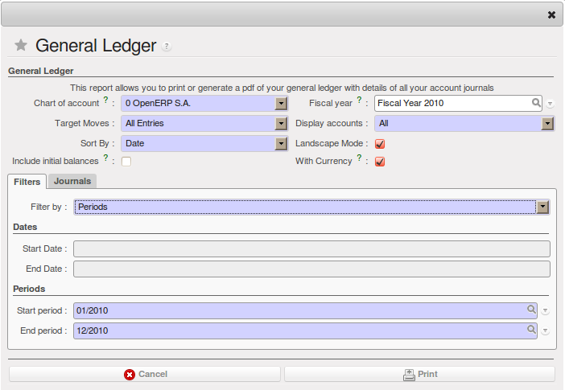
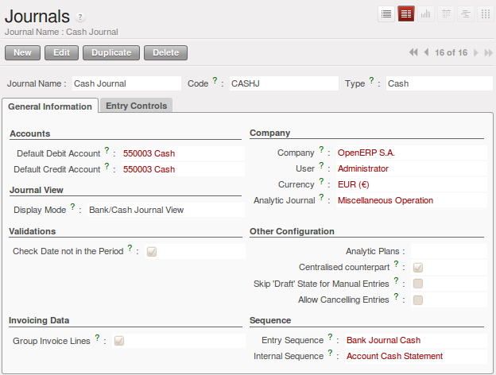
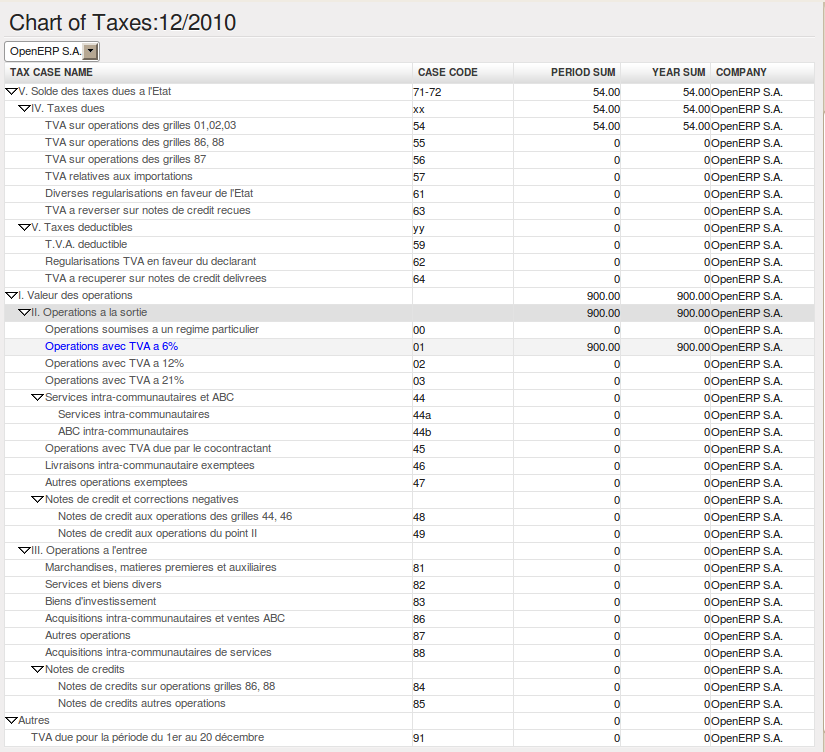

.. index::
   single: trial balance
   single: general ledger

General Ledger and Trial Balance
--------------------------------

To print the `General Ledger`, you can use the menu :menuselection:`Accounting --> Reporting --> Legal Reports --> Accounting Reports --> General Ledger`.
You will find the following wizard which is used to filter the resulting report.

   *Wizard for selecting the specific entries in report*

Select the proper options and journal(s) from the above wizard to print the `General Ledger`.

.. figure::  images/account_general_ledger.png
   :scale: 65
   :align: center

   *General Ledger*

.. index::
   single: module; account_simulation

.. tip::  Simulated Balance

        While you are printing account balances,
        if you have installed the :mod:`account_simulation` module from ``extra-addons``,
        OpenERP asks you which level of
        simulation to execute.

        Results will vary depending on the level selected.
        You could, for example, print the balance depending on various methods of amortization:

        * the normal IFRS method,

        * the French method.

        More generally, it enables you to make analyses using other simulation levels that you could
        expect.

To print the `Trial Balance`, you can use this menu :menuselection:`Accounting --> Reporting --> Legal Reports --> Accounting Reports --> Trial Balance`.
This report allows you to print or generate a PDF of your trial balance, allowing you to quickly check the balance of each of your accounts in a single report.

.. figure::  images/account_trial_balance.png
   :scale: 65
   :align: center

   *Trial Balance*

You can print the `General Ledger`  and `Trial Balance` report directly from  the `Account` form also.

.. index::
   single: balance sheet
   single: profit & loss

Balance Sheet and Profit & Loss Report
--------------------------------------

OpenERP also offers a Balance Sheet and a Profit & Loss Report.

A Balance Sheet is a financial statement that summarises the assets, liabilities and shareholders' equity of a company at a specific point in time. These three balance sheet segments give investors an idea as to what the company owns and owes, as well as the amount invested by the shareholders.

The balance sheet must follow the following formula:

Assets = Liabilities + Shareholders' Equity.

A balance sheet is often described as a snapshot of a company's financial condition.

The Profit & Loss Report is a financial statement which gives a summary of the revenues, costs and expenses during a specific period of time. Such a report provides information that shows the ability of a company to generate profit by increasing revenue and reducing costs. The P&L statement is also known as an "Income Statement".

The result shown in this report, is a the net profit or loss of a business.

In general, the Profit and Loss report will be used to determine profit ratios, to examine sales prices and costs, and to set marketing budgets, for instance.

.. index:: journal

The Accounting Journals
-----------------------

To configure the different journals use the menu :menuselection:`Accounting --> Configuration --> Financial Accounting --> Journals --> Journals`.

   *Definition of the Journal*

OpenERP provides three main reports regarding the journals:

* To print `Journals`, use the menu :menuselection:`Accounting --> Reporting --> Legal Reports --> Journals --> Journals`.

.. figure::  images/account_journal_print.png
   :scale: 65
   :align: center

   *Printing a Journal*

* To print `General Journals`, use the menu :menuselection:`Accounting --> Reporting --> Legal Reports --> Journals --> General Journals`.

* To print `Centralizing Journal`, use the menu :menuselection:`Accounting --> Reporting --> Legal Reports --> Journals --> Centralizing Journal`.

Tax Declaration
---------------

Information required for a tax declaration is automatically generated by OpenERP from invoices. In
the section on invoicing, you will have seen that you can get details of tax information from the area
at the bottom left of an invoice.

You can also get the information from the accounting entries in the columns to the right.

OpenERP keeps a tax chart that you can reach from the menu :menuselection:`Accounting --> Charts --> Chart of Accounts`. The structure of the chart is for calculating the tax
declaration, but all the other taxes can be calculated also(such as the French DEEE).

.. index::
   single: TVA
   single: VAT

   *Example of a Belgian TVA (VAT) declaration*

The tax chart represents the amount of each area of the tax declaration for your country. It is
presented in a hierarchical structure which lets you see the detail only of what interests you and
hides the less interesting subtotals. This structure can be altered as you wish to fit your needs.

You can create several tax charts if your company is subject to different types of tax or tax-like
accounts, such as:

* authors' rights,

* ecotaxes, such as the French DEEE for recycling electrical equipment.

Each accounting entry can then be linked to one of the tax accounts. This association is done
automatically by the taxes which had previously been configured in the invoice lines.

.. tip:: Tax Declaration

        Some accounting software manages the tax declaration in a dedicated general account.
        The declaration is then limited to the balance in the specified period.
        In OpenERP, you can create an independent chart of taxes, which has several advantages:

        * it is possible to allocate only a part of the tax transaction,

        * it is not necessary to manage several different general accounts depending on the type of sale and
          type of tax,

        * you can restructure your chart of taxes as you need.

At any time, you can check your chart of taxes for a given period using the report
:menuselection:`Accounting --> Reporting --> Generic Reporting --> Taxes --> Taxes Report`.

This data is updated in real time. This is very useful because it enables you to preview at any time
the tax that you owe at the start and end of the month or quarter.

Furthermore, for your tax declaration, you can click on one of the tax accounts to investigate the
detailed entries that make up the full amount. This helps you search for errors, such as when you have
entered an invoice at full tax rate when it should have been zero-rated for an inter-community trade or for
a charity.

In some countries, tax can be calculated on the basis of payments received rather than invoices
sent. In this instance, choose \ ``Payments``\   instead of
\ ``Invoices``\   in the :guilabel:`Based On` field. Even if you make your declaration on the
basis of invoices sent and received, it can be helpful to compare the two reports to see the
amount of tax that you pay but have not yet received from your customers.

.. Copyright © Open Object Press. All rights reserved.

.. You may take electronic copy of this publication and distribute it if you don't
.. change the content. You can also print a copy to be read by yourself only.

.. We have contracts with different publishers in different countries to sell and
.. distribute paper or electronic based versions of this book (translated or not)
.. in bookstores. This helps to distribute and promote the OpenERP product. It
.. also helps us to create incentives to pay contributors and authors using author
.. rights of these sales.

.. Due to this, grants to translate, modify or sell this book are strictly
.. forbidden, unless Tiny SPRL (representing Open Object Press) gives you a
.. written authorisation for this.

.. Many of the designations used by manufacturers and suppliers to distinguish their
.. products are claimed as trademarks. Where those designations appear in this book,
.. and Open Object Press was aware of a trademark claim, the designations have been
.. printed in initial capitals.

.. While every precaution has been taken in the preparation of this book, the publisher
.. and the authors assume no responsibility for errors or omissions, or for damages
.. resulting from the use of the information contained herein.

.. Published by Open Object Press, Grand Rosière, Belgium
