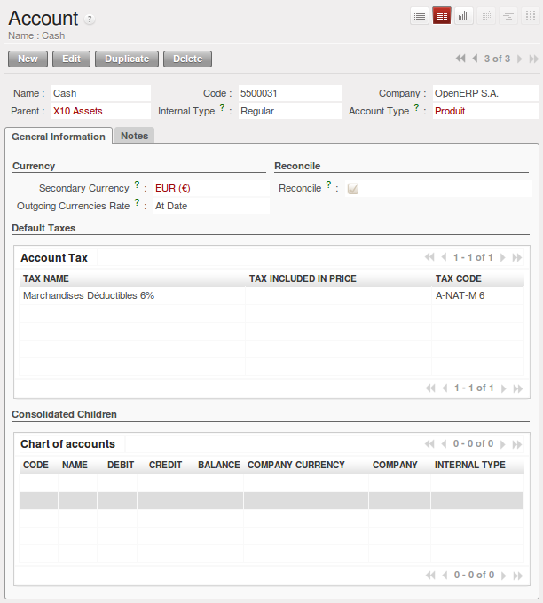

.. index::
   single: accounts; chart
   single: chart of accounts

Chart of Accounts
=================

.. index::
   single: modules; l10n_
   single: module; l10n_fr

You view active charts of accounts using the menu :menuselection:`Accounting --> Charts
--> Chart of Accounts`, and :guilabel:`Open Charts` for the selected year and account moves.

.. note:: Hierarchical Charts

	Most accounting software packages represent their charts of accounts in the form of a list. You can
	do this in OpenERP as well if you want to, but its tree view offers several advantages:

	* it lets you show and calculate only the accounts that interest you,

	* it enables you to get a global view of accounts (when you show only summary accounts),

	* it simplifies searches semantically,

	* it is more intuitive, because you can search for accounts on the basis of their classification,

	* it is flexible because you can easily restructure them.

The structure of the chart of accounts is hierarchical, with account subtotals called account views.
You can develop a set of account views to contain only those elements that interest you.

To get the detail of the account entries that are important to you, all you need to do is click the
account's :guilabel:`Code` (if you have no codes, you can select the line, then click :guilabel:`Switch`
to get the account definition, then click the :guilabel:`Entries` in the :guilabel:`LINKS` part of the toolbar).

Displaying the chart of accounts can take several seconds, because OpenERP calculates the debits,
credits and balance for each account in real time.

Using a Preconfigured Chart of Accounts
---------------------------------------

On installation, the software is given a default chart of accounts that is the same regardless of
your country. To install the chart of accounts and tax definitions for your own country, install the
module :mod:`l10n_XX` where XX represents your country code in two letters. For example, to get the
chart of accounts for France, install the module :mod:`l10n_fr`.

Some of these pre-built modules are comprehensive and accurate, others have rather more tentative
status and are simply indicators of the possibilities. You can modify these, or build your own
accounts onto the default chart, or replace it entirely with a custom chart.

Creating a Chart of Accounts
----------------------------

To add, modify or delete existing accounts, use the menu :menuselection:`Accounting -->
Configuration --> Financial Accounting --> Accounts --> Accounts`.

   *Definition of an account*

.. index::
   single: multi-lingual

.. tip:: Multi-lingual Fields

	In OpenERP, multi-lingual fields are marked by a small flag to their right.
	Click on the flag to get a translation of the value of the field in the different installed
	languages.
	You can also edit the translation.

	This enables you to efficiently manage other languages as you need them.
	The field's value appears in the language of the logged-in user or, in the case of reports printed
	for a partner, that of the partner.

The main account fields are:

*  :guilabel:`Name` : gives the account a name.

*  :guilabel:`Account Type` : account types determine an account's use in each journal.
   By default, the following types are available:
   ``View``, ``Receivable``, ``Payable``, ``Income``,
   ``Expense``, ``Tax``, ``Cash``, ``Asset``, ``Equity``.
   You can add new types through the menu
   :menuselection:`Accounting -->
   Configuration --> Financial Accounting --> Accounts --> Account Types`.
   Use the :guilabel:`View` type for accounts that make up the structure of the charts and have no
   account data inputs of their own.

*  :guilabel:`Internal Type` : internal types have special effects in OpenERP.
   By default, the following types are available:
   ``View``, ``Regular``, ``Receivable``, ``Payable``,
   ``Liquidity``, ``Consolidation``, ``Closed``.

.. index::
   pair: account; type

.. note:: Type of Account

	Account types are mainly used as informative titles.
	The only two types that have any particular effect are ``Receivable`` and ``Payable``.

	These two types are used by reports on partner credits and debits.
	They are calculated from the list of unreconciled entries in the accounts of one of these two types.

*  :guilabel:`Code` : the code length is not limited to a specific number of digits. Use code 0 for
   all root accounts.

*  :guilabel:`Secondary Currency` : forces all the moves for this account to have this secondary currency.

*  :guilabel:`Reconcile` : determines if you can reconcile the entries in this account. Activate this field
   for partner accounts and for chequeing (checking) accounts.

*  :guilabel:`Parent` : determines which account is the parent of this one, to create the tree structure of
   the chart of accounts.

*  :guilabel:`Default Taxes` : this is the default tax applied to purchases or sales using this account. It
   enables the system to generate tax entries automatically when entering data in a journal manually.

The tree structure of the accounts can be altered as often and as much as you wish without
recalculating any of the individual entries. So you can easily restructure your account during the
year to reflect the reality of the company better.

.. index::
   single: consolidation (accounting)
   pair: chart of accounts; virtual

Virtual Charts of Accounts
--------------------------

The structure of a chart of accounts is imposed by the legislation in effect in the country of
concern. Unfortunately, that structure does not always correspond to the view that a company's CEO
needs.

In OpenERP, you can use the concept of virtual charts of accounts to manage several different
representations of the same accounts simultaneously. These representations can be shown in real time
with no additional data entry.

So your general chart of accounts can be the one imposed by the statutes of your country, and your
CEO can then have other virtual charts as necessary, based on the accounts in the general chart. For
example, the CEO can create a view per department, a cash-flow and liquidity view, or consolidated
accounts for different companies.

The most interesting thing about virtual charts of accounts is that they can be used in the same way
as the default chart of accounts for the whole organization. For example, you can establish budgets
from your consolidated accounts or from the accounts from one of your companies.

.. tip:: Virtual Accounts

	Virtual accounts enable you to provide different representations of one or several existing charts
	of accounts.
	Creating and restructuring virtual accounts has no impact on the accounting entries.
	You can then use the virtual charts with no risk of altering the general chart of accounts or
	future accounting entries.

	Because they are used only to get different representation of the same entries, they are very useful
	for:

	* consolidating several companies in real time,

	* depreciation calculations,

	* cash-flow views,

	* getting more useful views than those imposed by statute,

	* presenting summary charts to other users that are appropriate to their general system rights.

	So there are good reasons for viewing the execution of financial transactions through virtual
	charts, such as budgets and financial indicators based on special views of the company.

To create a new chart of accounts you should create a root account using the menu
:menuselection:`Accounting -->
Configuration --> Financial Accounting --> Accounts --> Accounts`. Your top level account should have :guilabel:`Code` \ ``0``\   and :guilabel:`Type` \ ``View``\  . Then
you can choose your structure by creating other accounts of :guilabel:`Type` \ ``View``\   as necessary.
Check your virtual structure using the menu :menuselection:`Financial Management --> Charts -->
Charts of Accounts`.

You have to set :guilabel:`Internal Type` as ``Consolidation`` and set :guilabel:`Consolidated Children` accounts to make accounts consolidate.

Finally, when you have got your structure, you must make the general accounts and virtual accounts
match. For that, search the general accounts and ensure that each non-\ ``View``\   account there
also has a virtual account in the field :guilabel:`Parent`.

You can then check through your general chart of accounts as well as your virtual charts which give
you another representation of the company. All the actions and states in your general account are
also available in the virtual accounts.

Finally, you can also make virtual charts of accounts from other virtual charts. That can give an
additional dimension for financial analysis.

.. Copyright © Open Object Press. All rights reserved.

.. You may take electronic copy of this publication and distribute it if you don't
.. change the content. You can also print a copy to be read by yourself only.

.. We have contracts with different publishers in different countries to sell and
.. distribute paper or electronic based versions of this book (translated or not)
.. in bookstores. This helps to distribute and promote the OpenERP product. It
.. also helps us to create incentives to pay contributors and authors using author
.. rights of these sales.

.. Due to this, grants to translate, modify or sell this book are strictly
.. forbidden, unless Tiny SPRL (representing Open Object Press) gives you a
.. written authorisation for this.

.. Many of the designations used by manufacturers and suppliers to distinguish their
.. products are claimed as trademarks. Where those designations appear in this book,
.. and Open Object Press was aware of a trademark claim, the designations have been
.. printed in initial capitals.

.. While every precaution has been taken in the preparation of this book, the publisher
.. and the authors assume no responsibility for errors or omissions, or for damages
.. resulting from the use of the information contained herein.

.. Published by Open Object Press, Grand Rosière, Belgium
